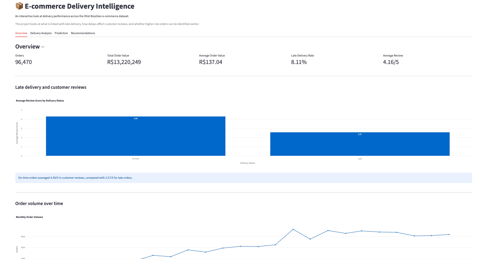
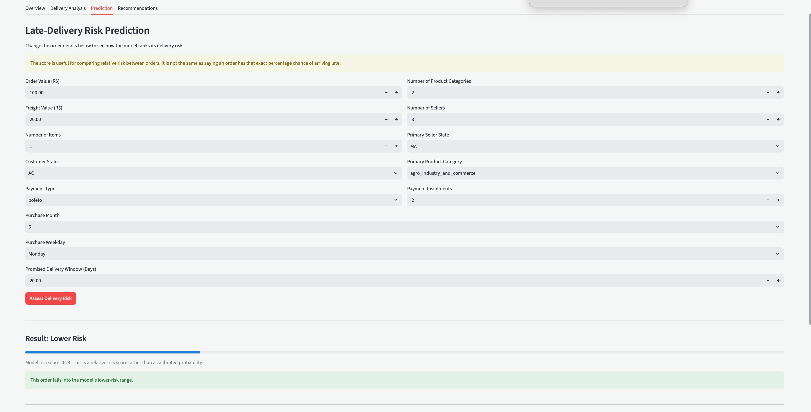

# E-commerce Delivery Intelligence

An end-to-end data analytics and machine-learning project exploring delivery performance across the Olist Brazilian e-commerce dataset.

The project looks at three main questions:

- What factors are associated with late deliveries?
- How does delivery performance relate to customer reviews?
- Can higher-risk orders be identified before delivery?



## Project Overview

The Olist dataset contains roughly 100,000 anonymised e-commerce orders across Brazil, with information on customers, products, sellers, payments, freight, delivery dates and reviews.

I combined the separate datasets into an order-level analytical dataset and used it to explore delivery performance, build a late-delivery prediction model and present the results through an interactive Streamlit app.

## Key Findings

### Late delivery is strongly linked with customer experience

Late orders received an average review score of **2.57/5**, compared with **4.29/5** for orders delivered on time.

### Delivery performance varies significantly by region

The overall late-delivery rate was **8.11%**. Among states with at least 100 orders, Alagoas (AL) recorded a late-delivery rate of **23.93%**.

### Higher freight costs were associated with greater delivery risk

Orders in the lowest freight-cost group had a late-delivery rate of **6.08%**, compared with **9.35%** for the highest freight-cost group.

### Longer promised delivery windows were associated with lower late rates

Orders in the longest promised-delivery group had a late-delivery rate of **5.41%**, compared with approximately **8–10%** across the shorter groups.

## Machine Learning

I compared Logistic Regression and Random Forest models for predicting whether an order would arrive late.

Rather than using a random train/test split, I used earlier orders for training and later orders for testing to better reflect how a model would work in practice.

Logistic Regression performed better on the validation period and was selected as the final model.

### Final test performance

- **ROC-AUC:** 0.717
- **Precision:** 0.100
- **Recall:** 0.340
- **F1 Score:** 0.155
- **Test late-delivery rate:** 5.29%

The model was more useful for ranking risk than making definitive yes/no predictions. The highest-risk 10% of orders had a **10.52% late-delivery rate**, compared with **5.29% overall**, representing approximately **1.99x lift**.



## Dashboard

The Streamlit dashboard contains four sections:

- **Overview** — headline order, delivery and customer metrics
- **Delivery Analysis** — trends across time, geography, freight and product categories
- **Prediction** — interactive late-delivery risk scoring
- **Recommendations** — business takeaways from the analysis

## Tools

- Python
- Pandas
- scikit-learn
- Streamlit
- Plotly
- Git / GitHub

## Project Structure

```text
ecommerce-delivery-intelligence/
├── app.py
├── requirements.txt
├── data/
├── models/
├── notebooks/
└── images/